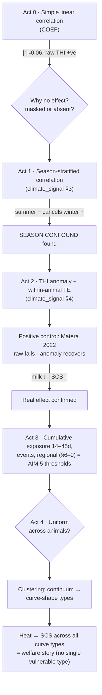

# Weather → Production/Welfare: Analysis Workflow

How the three code areas fit together to answer *"does climate stress affect milk yield and udder
health in the Italian Mediterranean Buffalo, and by how much?"* — and the order to run/tell them in.

**Run order:** `data/COEF` → `climate_signal/Climate_Signal_Analysis` → `clustering/Clustering_Analysis`.

| Folder | Role in the story | Delivers |
|---|---|---|
| `data/COEF.ipynb` | **Naive screen** — the puzzle appears here | "no linear effect", the feature set, the confound clue |
| `climate_signal/` | **Investigation** — diagnose, fix, validate, quantify | the *correct* weather effect + thresholds (aim 5) |
| `clustering/` | **Extension** — is the effect uniform? population structure | curve types + whether heat vulnerability is subgroup-specific |

---

## The story, act by act

### Act 0 — The naive start  (`COEF`)
We began the simplest possible way: **linear Pearson/Spearman correlation** of every weather index
(THI, temperature, humidity, WHI + lags) against `milk_kg` and `protein_p`.

- **Found:** no meaningful linear relationship (|r| ≈ 0.06); `DIM` and the previous test-day (lag-1)
  dominate. Worse, **raw THI correlated *positively* with milk** — as if heat *helps*.
- **The trap:** conclude *"weather doesn't matter / buffalo are resilient."* But the literature
  (Matera 2022, same breed) says heat clearly affects buffalo — so the null is **suspicious**. Either the
  data is broken or the method is wrong.
- COEF also surfaced the technical debts we carried forward: severe THI multicollinearity
  (`THI_1≈THI_2`), leaky lags, and — the key clue — that the effect might be **masked, not absent**.

### Act 1 — Why is the signal missing?  (`climate_signal` §2–3)
We treated the null as a symptom and tested what could be hiding the effect:

- Split the correlation **by season** → summer (negative) cancels winter (positive) → annual r ≈ 0;
  the monthly correlation flips sign across the year.
- **Diagnosis — the season confound:** milk and THI both peak in summer for *non-heat* reasons
  (feeding, calving cycle). Same-day raw THI conflates "hot" with "summer", which is exactly why it
  even shows the *wrong sign*.
- (Also: mutual information ≫ Pearson → real non-linearity the linear fit missed.)

### Act 2 — The fix, and proving it is real  (`climate_signal` §4–5)
We changed **how heat is measured and how the effect is estimated**:

- Heat = **THI anomaly** = THI above each farm's calendar-month normal → removes season.
- **Within-animal** demeaning → removes between-animal selection; control **DIM + parity**;
  farm-clustered SE.
- **Positive control — Matera 2022:** the raw analysis fails (wrong sign: raw THI says heat *helps*
  milk, +0.014); the anomaly recovers the correct biology — **milk ↓, SCS ↑**. This validates *both*
  the data and the method. (It is a within-animal fixed-effects **stand-in**, not a formal reproduction
  of Matera's THI-class × parity mixed model.)
- **But control lactation stage before believing SCS.** Under DIM × parity control the SCS–heat effect
  **halves in summer** (+0.0153 → **+0.0073**, p=0.011) and **disappears full-year** (+0.0044 →
  **−0.0002, p=0.91**). Much of the raw "heat → SCS" response was simply late-lactation SCS riding
  along with the season. The honest claim is **summer-only and modest**.

### Act 3 — How big, and over what timescale?  (`climate_signal` §6–9 — **proposal aim 5**)
- The **same-day** anomaly effect is small (milk ≈ −0.08 to −0.12 kg per +10 THI). So: is heat
  *cumulative*?
- **Trailing-window exposure** → the effect grows with accumulation; SCS peaks at a **~30-day** window
  (+0.16 per +10 THI, p≈7e-06), milk keeps growing to 90 d (lean on **14–45 d** for headline claims —
  longer windows go collinear with season).
- **Extreme events — intensity vs exposure (the key reconciliation).** Compared *within their own
  season* and DIM-controlled: a **heat wave costs −0.173 kg** vs a **cold snap −0.075 kg** — heat is
  **2.3× worse per event**. But cold snaps are **12.7× more frequent** (15.8% vs 1.2% of farm-days), so
  cold carries **≈5.5× the annual burden**. *Both* are true: buffalo are **heat-sensitive per event but
  cold-exposed far more often** — which reproduces Matera 2022's "cold reduces milk more than heat"
  **at the burden level**, without the season-confounded −0.35 kg figure that originally "supported" it.
  ⚠️ *Caveat:* the anomaly design removes the seasonal **level**, so it measures **acute** cold (a snap
  vs an ordinary winter day) and **cannot** test **chronic** winter cold — that is inseparable from
  feeding/calving/photoperiod. If cold stress is mostly chronic, we understate it.
- **Regional heat sensitivity:** milk loss concentrates **outside** the DOP heartland (Rest −0.142\*\*\*
  vs Campania+Lazio ≈0); **ECM −0.175\*\*\*** overall is the most robust production casualty. Per-farm
  slopes (n=239): median −0.086 kg, 69% negative → genuine farm heterogeneity.
- **Is the dose–response curved? No — and that matters.** Part 2's mutual information showed weather
  relates to milk **non-linearly** (MI ≈ 20× what the linear r implies) — but ~80% of that is the
  **season calendar**. Once deseasonalized and DIM-controlled, the **causal** curve is essentially
  **linear**: quadratic terms are tiny (|β₂| ≤ 0.0016) and **ns for milk in summer** (p=0.23), the binned
  curve declines monotonically with **no kink or threshold**, and the classic **temperature U-shape
  ("cold 3× worse") does not survive** (cold −0.085 vs heat −0.079 — symmetric and ~3× smaller than the
  original claim). Within summer there is **no clean absolute-THI breakpoint** (only a hint near 78–80,
  matching the heat-wave cutoff), and **severe heat THI>82 is absent from the data**, so that band is
  untestable.
  → **The non-linearity is in *time*, not *dose*.** So aim 5's "thresholds" are best expressed as
  **events (heat wave >78) + exposure windows (14–45 d)**, not a dose breakpoint — and the aim-6 model
  can keep a **linear** heat term (no splines/GAMs needed).
- **Deliverable:** the thresholds and exposure windows at which weather affects the targets.

### Act 4 — Is the effect the same for every animal?  (`clustering`)
- New question: is heat vulnerability **uniform**, or concentrated in a subgroup we must model apart?
- First, do buffalo even form discrete groups? Point-trait clustering → **no, a continuum** (the "clean"
  clusters were a parity artifact). Professors' steer: **no PCA, cluster on 2 real features, split by
  season**.
- The real structure is in **lactation-curve shape** (Wood's features) → interpretable curve *types*.
- Linking curve types back to heat → SCS: heat raises SCS **across all curve types** (no single
  isolated vulnerable cluster) — which **qualifies** the climate finding and ties clustering to the
  welfare (SCS) story.

---

## The logic as a flow

---

## What to run, in order

1. **`data/COEF.ipynb`** — *"is there any linear weather signal?"* → screens features, exposes the
   confound and the multicollinearity. (Start here.)
2. **`climate_signal/Climate_Signal_Analysis.ipynb`** — the 9-part core: audit → correlations →
   season confound → **anomaly + Matera control** → within-animal effects → **cumulative exposure /
   thresholds** → events → regional → farm heterogeneity.
3. **`clustering/Clustering_Analysis.ipynb`** — the 6-part extension: baseline clustering → no-PCA
   pairs → parity de-confound (continuum) → season/climate pairs → **curve-shape types** →
   curve-type × heat/SCS.

**One-sentence thesis arc:** *A naive linear analysis found no weather effect — even the wrong sign;
recognising a season confound and switching to the within-animal THI anomaly recovered a small but
real milk loss and a modest, summer-only, cumulative (~30-day) udder-health response, while
separating **intensity** from **exposure** showed buffalo to be heat-sensitive per event yet
cold-exposed far more often — reproducing the literature's "cold matters more" conclusion at the
burden level, and explaining why.*

### Headline numbers (corrected, full 1.6M rows)
| Result | Value |
|---|---|
| Raw same-day THI → milk (confounded) | **+0.014** (wrong sign) |
| THI anomaly → milk, within-animal, DIM-ctrl | **−0.008 to −0.012** per +1 THI |
| THI anomaly → SCS, summer, DIM-ctrl | **+0.0073** (p=0.011); full-year **≈0** (p=0.91) |
| Best exposure window | SCS **~30 d**; milk 14–45 d |
| Heat wave vs cold snap (per event) | **−0.173** vs **−0.075 kg** (heat 2.3× worse) |
| Heat wave vs cold snap (annual burden) | cold **5.5×** heat (12.7× more frequent) |
| ECM (most robust) | **−0.175\*\*\*** per +10 THI-anom |
| Animal ICC (milk) | **0.376** |
